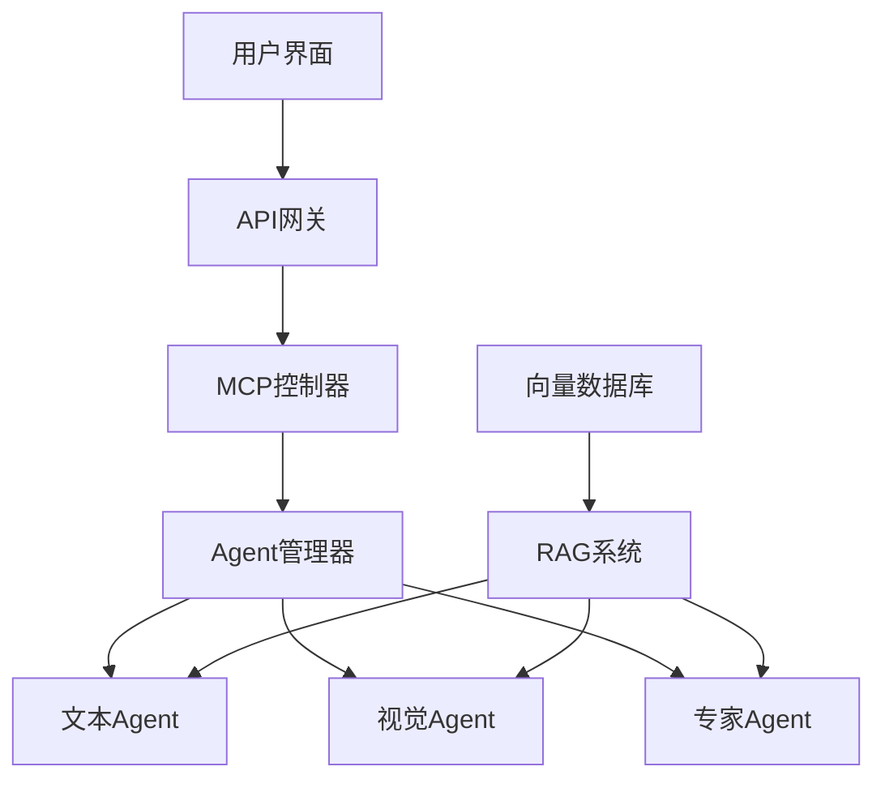

# 企业级Java多Agent系统

基于MCP协议和LangGraph框架实现的企业级Java多Agent系统，集成RAG技术增强知识检索能力。

## 项目概述

本项目是一个企业级的AI多Agent系统实现，主要特点：

1. 基于MCP (Master Control Protocol) 通信协议
2. 使用LangGraph实现Agent工作流
3. 集成RAG (检索增强生成) 技术
4. 完全基于Java语言实现
5. 采用微服务架构设计

## 系统架构



## 技术栈

- **Java 17+**: 核心编程语言
- **Spring Boot 3**: 应用框架 
- **LangGraph4j**: 基于Java的LangGraph实现
- **Kafka/RabbitMQ**: 消息队列
- **Elasticsearch/Weaviate**: 向量数据库
- **LangChain4j**: LLM调用框架
- **Redis**: 分布式缓存
- **Docker**: 容器化部署
- **Kubernetes**: 容器编排(生产环境)

## 项目结构

```
enterprise-ai/
├── pom.xml                                # Maven配置文件
├── src/
│   ├── main/
│   │   ├── java/com/enterprise/ai/
│   │   │   ├── Application.java           # Spring Boot启动类
│   │   │   ├── config/                    # 配置类
│   │   │   ├── controller/                # API控制器
│   │   │   ├── core/                      # 核心组件
│   │   │   │   ├── mcp/                   # MCP协议实现
│   │   │   │   │   ├── Controller.java    # MCP控制器
│   │   │   │   │   ├── MessageBus.java    # 消息总线
│   │   │   │   │   ├── Message.java       # 消息类
│   │   │   │   │   ├── Task.java          # 任务类
│   │   │   │   │   └── enums/             # 枚举类型
│   │   │   │   └── langgraph/             # LangGraph实现
│   │   │   ├── agent/                     # 多Agent实现
│   │   │   │   ├── BaseAgent.java         # Agent基类
│   │   │   │   ├── TextAgent.java         # 文本Agent
│   │   │   │   └── VisionAgent.java       # 视觉Agent 
│   │   │   ├── rag/                       # RAG实现
│   │   │   │   ├── Retriever.java         # 检索器
│   │   │   │   ├── DocumentProcessor.java # 文档处理器
│   │   │   │   └── VectorStore.java       # 向量存储接口
│   │   │   ├── service/                   # 业务服务
│   │   │   ├── model/                     # 数据模型
│   │   │   └── util/                      # 工具类
│   │   └── resources/
│   │       ├── application.yml            # 应用配置
│   │       └── static/                    # 静态资源
│   └── test/                              # 测试代码
└── README.md                              # 项目说明
```

## 快速开始

### 环境要求

- JDK 17+
- Maven 3.8+
- Docker (可选，用于容器化部署)
- Kafka/RabbitMQ (消息队列)
- Elasticsearch/Weaviate (向量数据库)

### 构建与运行

1. 克隆项目
```bash
git clone https://github.com/yourusername/enterprise-ai-java.git
cd enterprise-ai-java
```

2. 编译项目
```bash
mvn clean package
```

3. 启动服务
```bash
java -jar target/enterprise-ai-1.0.0.jar
```

### Docker部署

```bash
docker build -t enterprise-ai-java .
docker run -p 8080:8080 enterprise-ai-java
```

## 核心功能

1. **MCP通信框架**: Agent之间的标准化通信协议
2. **多Agent协作**: 基于能力的任务分派与协作处理
3. **RAG知识检索**: 向量数据库支持的知识检索增强
4. **LangGraph工作流**: 基于图的Agent执行流程定义
5. **分布式部署**: 支持微服务架构下的分布式部署

## 配置说明

主要配置项在`application.yml`中，包括:

- LLM服务配置
- 向量数据库连接
- 消息队列设置
- Agent能力定义
- 系统容量参数

## 扩展与定制

系统设计支持多种扩展方式:

1. 添加新Agent类型
2. 集成新的向量数据库
3. 自定义LangGraph工作流
4. 扩展RAG检索策略

## 许可证

声明：未经作者同意禁止用于商业用途
MIT License 

## 联系作者
“AIbot-hum“ @qq749812679
